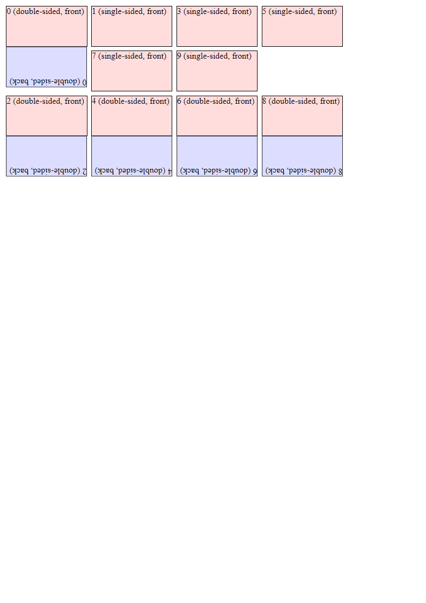

# Distraction

Distraction is a boardgame design and prototyping toolkit, allowing you to create prototypes of boardgames using React.

Instructions follow later!

## Installation

`npm install distraction`

## Usage

```tsx
import { Builder, Renderer } from 'distraction';
import React from 'react';

const builder = new Builder();
for (let i = 0; i < 10; i++) {
  builder.addElement({
    front: () => <div style={{ width: '100%', height: '100%', border: "0.2mm solid black", boxSizing: 'border-box', backgroundColor: '#fdd' }}>{i} (front)</div>,
    back: i % 2 === 0 ? () => <div style={{ width: '100%', height: '100%', border: "0.2mm solid black", boxSizing: 'border-box', backgroundColor: '#ddf' }}>{i} (back)</div> : undefined,
    width: 20,
    height: 10
  });
}
const renderer = new Renderer(builder.build());
renderer.renderToPNGs((i) => `./foo${i}.png`)
```

output:


